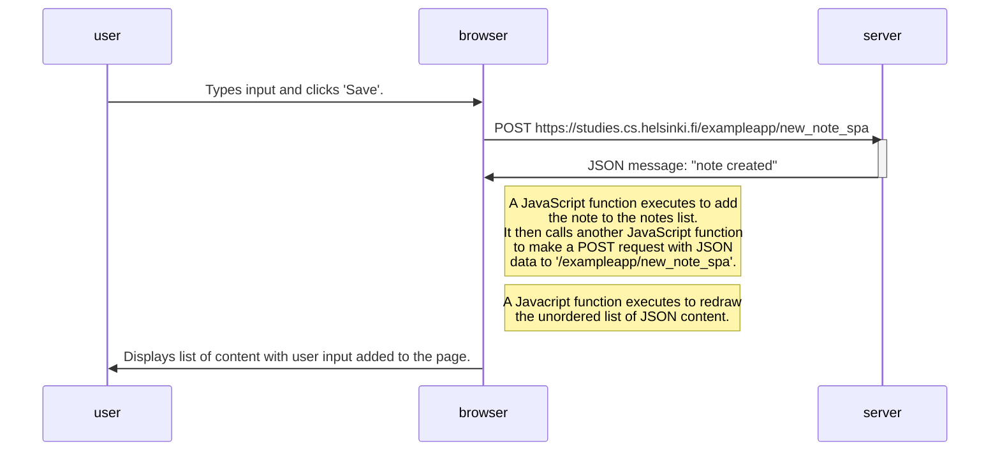

```mermaid
    sequenceDiagram
        participant user
        participant browser
        participant server
    
        user->>browser: Types input and clicks 'Save'.
    
        browser->>server: POST https://studies.cs.helsinki.fi/exampleapp/new_note_spa
        activate server
        server->>browser: JSON message: "note created"
        deactivate server
    
        Note right of browser: A JavaScript function executes to add <br/>the note to the notes list. <br/>It then calls another JavaScript function <br/>to make a POST request with JSON <br/>data to '/exampleapp/new_note_spa'.
    
        Note right of browser: A Javacript function executes to redraw <br/>the unordered list of JSON content.
    
        browser->>user: Displays list of content with user input added to the page.
```
