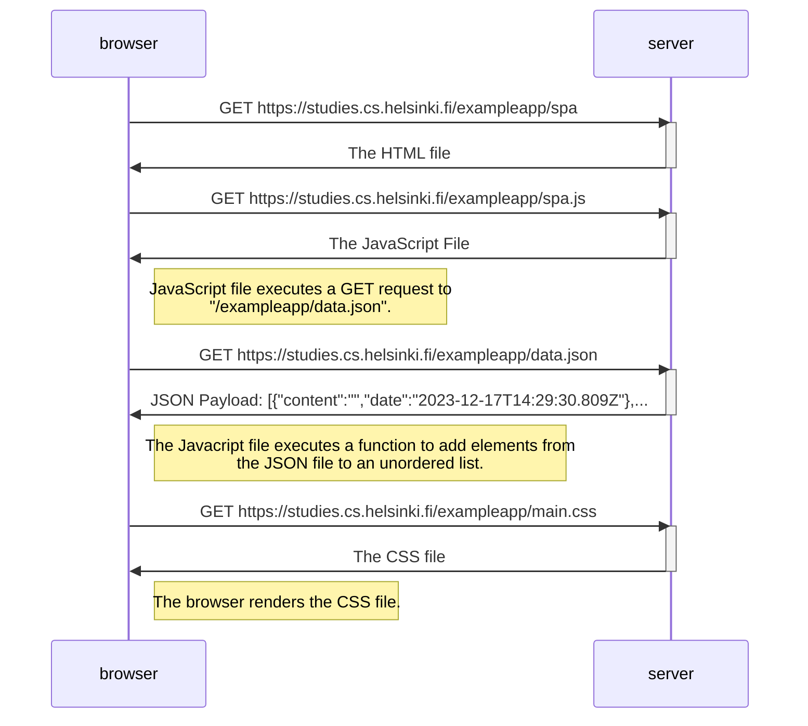

```mermaid
    sequenceDiagram
        participant browser
        participant server
    
        browser->>server: GET https://studies.cs.helsinki.fi/exampleapp/spa
        activate server
        server->>browser: The HTML file
        deactivate server
    
        browser->>server: GET https://studies.cs.helsinki.fi/exampleapp/spa.js
        activate server
        server->>browser: The JavaScript File
        deactivate server
    
        Note right of browser: JavaScript file executes a GET request to <br/>"/exampleapp/data.json".
    
        browser->>server: GET https://studies.cs.helsinki.fi/exampleapp/data.json
        activate server
        server->>browser: JSON Payload: [{"content":"","date":"2023-12-17T14:29:30.809Z"},...
        deactivate server
    
        Note right of browser: The Javacript file executes a function to add elements from <br/>the JSON file to an unordered list.
    
        browser->>server: GET https://studies.cs.helsinki.fi/exampleapp/main.css
        activate server
        server->>browser: The CSS file
        deactivate server
    
        Note right of browser: The browser renders the CSS file.
```
