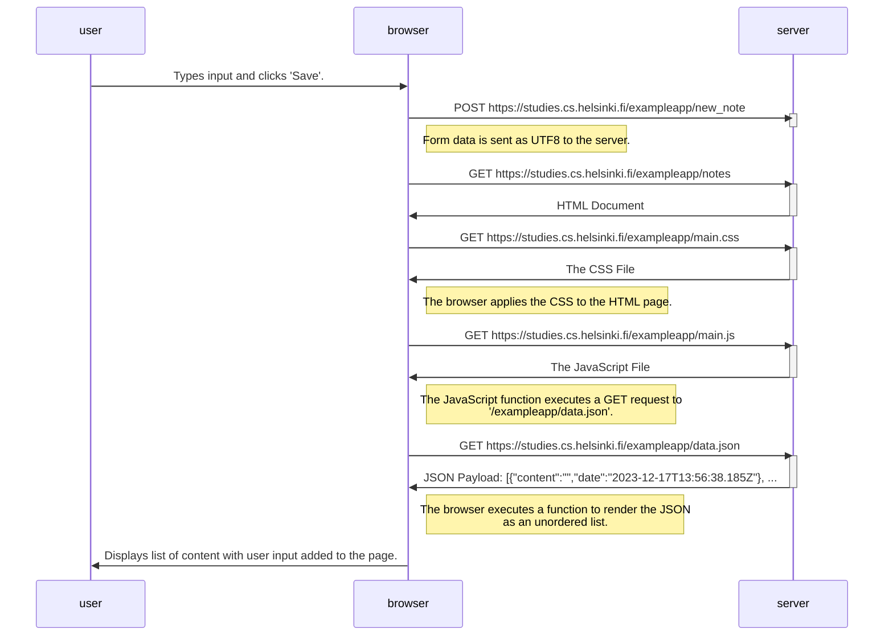

```mermaid
    sequenceDiagram
        participant user
        participant browser
        participant server
    
        user->>browser: Types input and clicks 'Save'.
    
        browser->>server: POST 	https://studies.cs.helsinki.fi/exampleapp/new_note
        activate server
        deactivate server
    
        Note right of browser: Form data is sent as UTF8 to the server.
    
        browser->>server: GET https://studies.cs.helsinki.fi/exampleapp/notes
        activate server
        server->>browser: HTML Document
        deactivate server
    
        browser->>server: GET https://studies.cs.helsinki.fi/exampleapp/main.css
        activate server
        server->>browser: The CSS File
        deactivate server
    
        Note right of browser: The browser applies the CSS to the HTML page.
    
        browser->>server: GET https://studies.cs.helsinki.fi/exampleapp/main.js
        activate server
        server->>browser: The JavaScript File
        deactivate server
    
        Note right of browser: The JavaScript function executes a GET request to <br/>'/exampleapp/data.json'.
    
        browser->>server: GET https://studies.cs.helsinki.fi/exampleapp/data.json
        activate server
        server->>browser: JSON Payload: [{"content":"","date":"2023-12-17T13:56:38.185Z"}, ...
        deactivate server
    
        Note right of browser: The browser executes a function to render the JSON <br/>as an unordered list.
    
        browser->>user: Displays list of content with user input added to the page.

```
